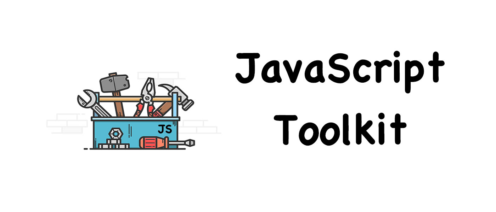

# JavaScript Toolkit

- 项目继承自 [30-seconds-of-code](https://github.com/Chalarangelo/30-seconds-of-code) 并添加本人编写与网络收集而来的代码片段
- 使用 <kbd>Ctrl</kbd> + <kbd>F</kbd> 或者 <kbd>command</kbd> + <kbd>F</kbd> 来搜索查询代码片段

## 目录

### 🔌适配器 Adapter

View contents

### 🗂数组 Array

View contents

### 🌐浏览器 Browser

View contents

### 📆日期 Date

View contents

### 🎛函数 Function

View contents

### ➗数学 Math

View contents

### 📦节点 Node

View contents

### 🗃对象 Object

View contents

### 🔠字符串 String

View contents

### 📃类型 Type

View contents

### 🛠工具 Utility

View contents

